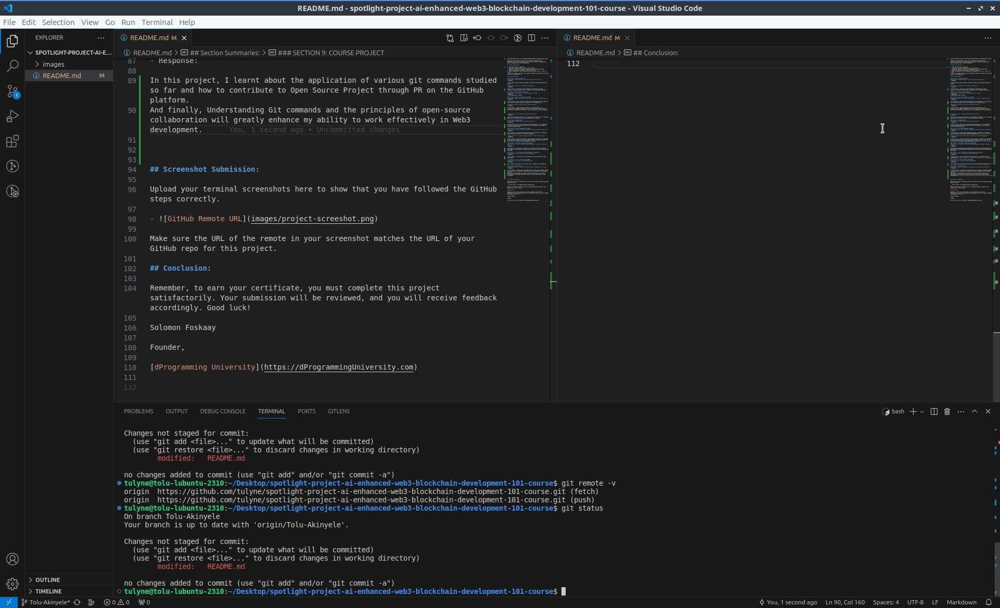

stan# Spotlight Project For AI-Enhanced Web3/Blockchain Development 101 Course

Welcome to the Spotlight Project for the AI-Enhanced Web3/Blockchain Development 101 Course at dProgramming University. Follow the instructions below to complete your project submission.

## Project Instructions:

1. Star and fork this  repository.
2. Clone your forked repository to your local machine.
3. Create and switch to a new branch named after your certificate name.
4. Answer the questions provided in each section summary.
5. Take a screenshot of your terminal after running `git remote -v` and `git status`.
6. Push your changes and open a pull request to merge your branch into the main branch of this repository.

## Section Summaries:

### SECTION 1: THE WEB3 REVOLUTION
**Exploring the Web3 Revolution: The New Decentralized Internet**
- Response: 

I learn about how Web3 envolved from Web1 to Web3 and the decentralization it brought.

**Unlocking the Potential of Blockchain Technology**
- Response: 

In this lesson, I learnt alot about Blockchain technology like nodes, validator, consensus mechanism etc to prepare me as a Blockchain developer.

### SECTION 2: SMART CONTRACTS UNVEILED
**Smart Contracts Explained: The Building Blocks of Web3**
- Response: 
I learnt about smart contract

### SECTION 3: DIVE INTO BLOCKCHAIN PLATFORMS
**Bitcoin Blockchain: The Origin and Evolution of the First Cryptocurrency**
- Response: 

In this lesson, I learnt about how Bitcoin was conceptualised, its transaction and consensus Mechanism and also it being the first Cryptocurrency.

**Ethereum Ecosystem: A Deep Dive into EVM Blockchains**
- Response: 

In this lesson, I learnt about how Ethereum was conceptualised, it's transaction and consensus mechanism. Also it being the first smart contract blockchain and examples of Blockchains that are compatible with the Ecosystem.

**Solana Ecosystem: The High-Speed Blockchain Network**
- Response: 

Learnt that the Solana Ecosystem is a high -speed one because of it's consensus mechanism (PoS & PoH) and its various challenges and solutions.

### SECTION 4: DECODING DAPPS
**dApps Decoded: Unpacking Decentralized Applications**
- Response: 

In this lesson. I learnt what a decentralised application is,it's components (frontend, middleware & black end) and also the challenges, limitations and solutions being developed.

### SECTION 5: TOP WEB3 PROGRAMMING LANGUAGES
**Vanilla Solidity: Smart Contract Language of Ethereum/EVM Smart Contracts**
- Response: 

In this lesson. I learnt about Solidity’s history, applications, challenges, solutions and divers tools for solidity development.

**Solang Solidity for Solana: Adapting Solidity for Non-EVM Blockchains**
- Response: 

In this lesson, I about how Solidity is being adopted by Solana, the challenges in porting Solidity code to this blockchain and how to overcome them and the divers tools for Solang Solidity development in Solana.

### SECTION 6: SETUP WEB3 DEVELOPMENT ENVIRONMENT
**Web3 Developer Toolbox: Setting up Web3 Development Environment (Ethereum/Solana)**
- Response: 

Learnt about the various tools essential for setting up a web3 development environment for both Ethereum & Solana and how vital they are for aspiring web3 developers.

### SECTION 7: GIT & GITHUB FOR WEB3 DEVELOPMENT COLLABORATION
**Introduction To Git & GitHub for Web3 Development**
- Response: 

In this lesson, I learnt about git and GitHub and their importance in Web 3 development.

### SECTION 8: AI TOOLS FOR WEB3 DEVELOPMENT
**Introduction To AI Tools For Web3 Development**
- Response: 

Learnt about the importance of AI and AI tools in modern web 3 development.

### SECTION 9: COURSE PROJECT
**Spotlight Project For AI-Enhanced Web3/Blockchain Development 101 Course**
- Response: 

In this project, I learnt about the application of various git commands studied so far and how to contribute to Open Source Project through PR on the GitHub platform.
And finally, Understanding Git commands and the principles of open-source collaboration will greatly enhance my ability to work effectively in Web3 development.

## Screenshot Submission:

Upload your terminal screenshots here to show that you have followed the GitHub steps correctly.

- 

Make sure the URL of the remote in your screenshot matches the URL of your GitHub repo for this project.

## Conclusion:

Remember, to earn your certificate, you must complete this project satisfactorily. Your submission will be reviewed, and you will receive feedback accordingly. Good luck!

Solomon Foskaay

Founder,

[dProgramming University](https://dProgrammingUniversity.com)

